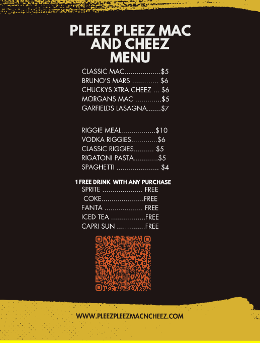

<!DOCTYPE html>
<html lang="en">
<head>
  <meta charset="UTF-8">
  <title>Pleez Pleez Mac and Cheese</title>
  
</head>
<body>

  <header>Pleez Pleez Mac and Cheese</header>

  <button onclick="toggleMenu()">Show Menu</button>

  

  

</body>
</html>
